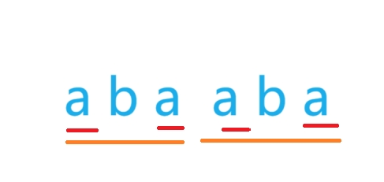

## kmp算法

kmp算法用于解决一个字符串在另一个字符串中出现次数的求解问题

### 前缀和后缀
kmp算法的核心是对字符串**相同前后缀**的理解和使用

假设字符串`abcdabc`, 则该字符串的相同前后缀为`abc`

### 怎么使用？

比如有字符串`s = abcdabcm......`和字符串`p = abcdabct`

可以发现，s和p前面的部分只有m、t不相等，如果是暴力算法，那么下一步应该是考虑s的**第二**个字符和p的**第一**个字符是否相等，而kmp是考虑 s 的 m 和 p 的 d 是相等，即 s 并没有回退到m之前的字符开始匹配。

**关键**：p 串中 't' 前面的串 `abcdabc` 有共同前后缀 `abc`, 所以，可以直接把该前缀后移过来， 如图

### 每次s 和 p 存在字符不匹配时， 我应该让 p 后移多少 ？

这是kmp的核心，要解决这个问题，需要引入next数组

next数组是利用p建立的，next[i]表示p[0~i]**最长**的共同前后缀**长度**，例如, 对于`abcdabc`，next[0] = 0, next[6] = 3

建立next数组的代码
~~~c++
vector<int> buildNext(string p)
    {
        int n = p.length();
        vector<int> next(n);
        int i = 1, j = 0;
        next[0] = 0;
        while (i < n)
        {
            if (p[j] == p[i])
            {
                next[i] = j + 1;
                j++;
                i++;
            }
            else
            {
                if (j)
                {
                    j = next[j - 1];  // 回退操作
                }
                else
                {
                    next[i] = 0;
                    i++;
                }
            }
        }
        return next;
    }

~~~

要建立next数组的原理由于要绘制太多图片，所以这里不做讲解。

**讲几个有意思的点：**   
1. i 和 j 是什么？
    > i 指的是需要确定的下标位置， j表示已扫描字符串的最长公共前后缀的长度, 即 p[0 ~ i - 1]的最长公共前后缀的长度， **注意**：单独一个字符没有前后缀的概念，故next[0] = 0, j = 0， i = 1
2. 回退操作为什么可以反复执行?
   > 这点有点像递归，一张图就明白了
   >   
   > 最开始最长前后缀为`aba`，而`aba`又有最长前后缀`a`。**即前缀的相同前后缀，在后缀中也有相同的前后缀**

